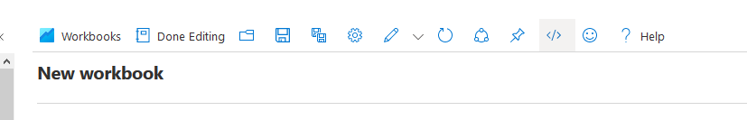
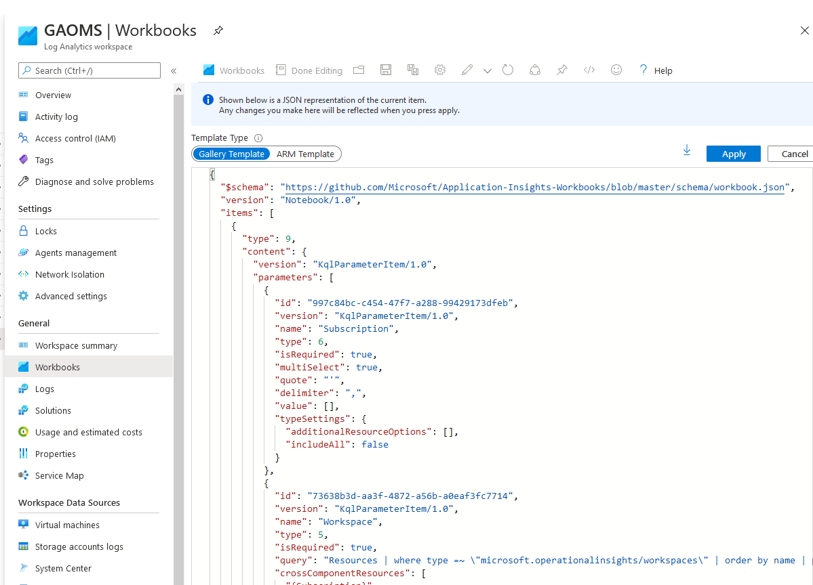

# Barracuda CloudGen Firewall for Azure - Log Analytics Workspace

## Introduction
The contents here are intended to improve the reporting avaialable for the Barracuda CloudGen WAN.  They provide basic information on;

- VPN Status
- Device Availabilty
- Device Performance
- Device Bandwidth
- WAN Latency

This template will deploy a workbook into a new or existing Log Analytics workspace

These templates use the existing performance data provided to Log Analytics, for more detailed data follow the instructions under Additional Reporting.

The CloudGen Firewall can input into OMS any of it's logs via syslog and these can be used to create custom reports in further detail. 

## Prerequisites

1. For content to appear in any of these dashboards you must have connected your solution to Log Analytics. You can do this by following the steps here: (https://campus.barracuda.com/product/cloudgenwan/doc/93192480/how-to-configure-log-streaming-to-microsoft-azure-log-analytics-workspace/)

## Azure Sentinel Support
TYou can also import the workbook into Azure Sentinel instead, this does not require Sentinel to function.

## Deployment
### Azure Portal for Workbooks only

To manually deploy a workbook via Azure Portal;

- Open https://portal.azure.com
- Navigate to Log Analytics workspaces
- Select your chosen workspace
- From the menu on the left, select Workbooks
- Create New
- Click on the Advanced Editor button 
- Open the  in Raw mode and copy and paste the contents between GitHub and the editor in the Azure portal
- Click on the Apply button. Click on the Advanced Editor button # AzureCGWWorkbook
